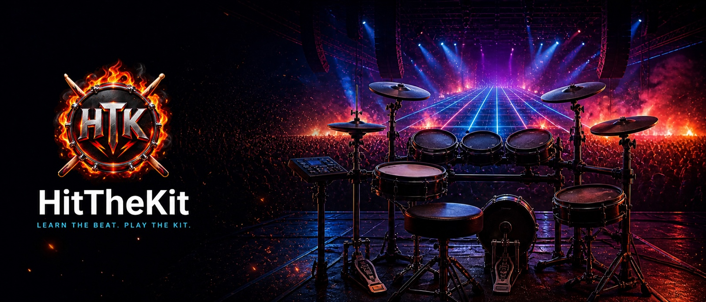
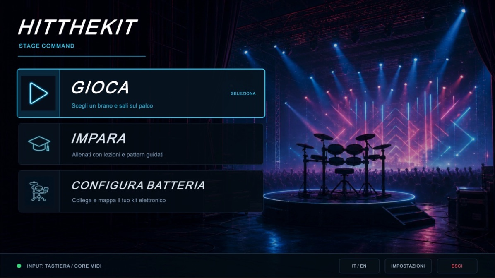
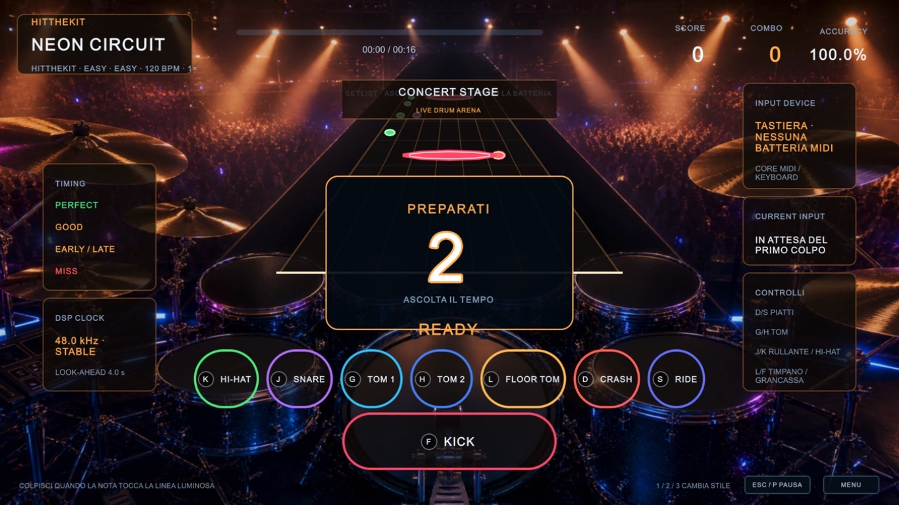

<p align="center">
  Open-source electronic-drum learning meets a rhythm-game highway, progressive
  lessons, and deterministic timing.
</p>

<p align="center">
  
  
  
  
  <a href="https://github.com/sponsors/Codewriter90x"></a>
</p>

<p align="center">
  
</p>

<p align="center">
  <a href="https://codewriter90x.github.io/HitTheKit/en/">Website</a> ·
  <a href="#what-works-today">Experience</a> ·
  <a href="#build-from-source">Build from source</a> ·
  <a href="https://github.com/Codewriter90x/HitTheKit/wiki">Wiki</a> ·
  <a href="docs/README.md">Documentation</a> ·
  <a href="ROADMAP.md">Roadmap</a> ·
  <a href="https://github.com/sponsors/Codewriter90x">Sponsor</a>
</p>

HitTheKit is an open-source rhythm game for electronic drum kits. It helps
beginners understand what to hit and when through clear visual cues and short,
rewarding practice sessions instead of requiring traditional music notation.
The playable Unity vertical slice is backed by an engine-independent,
automatically tested hit-matching core.

## What works today

| **Play** | **Learn** | **Configure** |
| --- | --- | --- |
| Follow a perspective drum highway with timing judgments, results and three original visual environments. | Build coordination through 12 playable beginner lessons with study speeds and mastery goals. | Discover and map an electronic kit through guided hits, review and sound-check flows. |
| Keyboard on desktop; CoreMIDI electronic drums on macOS Apple Silicon. | A second semester remains visible as a roadmap rather than simulated assessment. | Deterministic simulation remains available when no supported MIDI backend is present. |

The same gameplay session powers Play and Learn. Charts, the DSP song clock,
hit matching and MIDI input are shared rather than reimplemented per mode.

## See it in action

These are real captures of the current Unity application running the original,
rights-clean demo content—not promotional mockups.

| Main menu | Concert Stage gameplay |
| --- | --- |
| [](website/assets/images/screenshots/main-menu.jpg) | [](website/assets/images/screenshots/gameplay-concert-stage.jpg) |
| Choose Play, Learn or configure an electronic drum kit. | Follow the perspective highway using a keyboard or a supported CoreMIDI kit. |

## Project status

> [!IMPORTANT]
> HitTheKit is an active pre-release project. This public repository distributes
> source code and the website only. No Unity player binary is currently approved
> for public distribution. Historical builds and private development history are
> intentionally excluded.

| Capability | Current status |
| --- | --- |
| Keyboard gameplay | macOS, Windows and Linux |
| Electronic-drum MIDI | macOS Apple Silicon through CoreMIDI |
| Learning path | 12 playable lessons; 12 more planned |
| Included music | Original rights-clean demo only |
| Public binary | Not yet approved for distribution |

Current limitations and release gates are tracked in
[SUPPORT.md](SUPPORT.md) and the
[public-release checklist](docs/release/PUBLIC_RELEASE_CHECKLIST.md).

## Build from source

Requirements: the .NET SDK selected by [`global.json`](global.json) and Unity
`6000.5.6f1` for the game client.

```shell
dotnet test HitTheKit.sln
./scripts/sync-core-to-unity.sh
```

Then open `src/HitTheKit.Unity` in Unity Hub. On macOS Apple Silicon, build the
optional CoreMIDI plug-in before testing a real electronic kit:

```shell
./scripts/build-coremidi-plugin-macos-arm64.sh
```

The generated Unity core DLL and native plug-in are intentionally ignored by
Git. See the [development guides](docs/README.md#development-and-testing) for
platform-specific setup, tests and clean-build expectations.

## Architecture at a glance

```text
src/HitTheKit.Core/       deterministic timing and hit matching
src/HitTheKit.MidiTool/   offline MIDI inspection tooling
src/HitTheKit.Unity/      Unity gameplay, learning and device setup
native/                   macOS CoreMIDI C ABI plug-in
website/                  dependency-free public website
docs/                     architecture, design, development and release guides
```

The core targets `netstandard2.1` and remains independent of Unity. Unity owns
presentation and composition; native MIDI adapters feed the same normalized
input boundary used by keyboard and simulated sources. Start with the
[architecture map](docs/README.md#architecture).

## Documentation

The [public Wiki](https://github.com/Codewriter90x/HitTheKit/wiki) is the
beginner-friendly handbook for building, configuring and using HitTheKit. Its
pages are generated from versioned sources under `docs/wiki/`.

The versioned [documentation hub](docs/README.md) remains the source of truth
for deeper technical documentation. It organizes:

- architecture and domain boundaries;
- gameplay, learning and device-setup design;
- MIDI, CoreMIDI and hardware validation;
- development, tests and packaging;
- release, legal and governance material.

Keeping both documentation layers beside the code makes changes reviewable and
prevents the rendered Wiki from becoming stale.

## Contributing and support

- Read [CONTRIBUTING.md](CONTRIBUTING.md) before opening a pull request.
- Use [GitHub Discussions](https://github.com/Codewriter90x/HitTheKit/discussions)
  for ideas and questions.
- Report reproducible problems through the
  [issue templates](https://github.com/Codewriter90x/HitTheKit/issues/new/choose).
- See [SECURITY.md](SECURITY.md) for private vulnerability reporting.
- See [SUPPORT.md](SUPPORT.md) for supported environments and diagnostics.

Substantial external code contributions are temporarily paused while the
project completes legal review of its contribution and licensing model.

## Why sponsor HitTheKit?

Keeping an open electronic-drum game healthy requires hardware testing,
accessibility and localization work, release validation, documentation and
original rights-clean assets—not only feature development.

Sponsorship helps fund:

- testing across drum modules, MIDI devices, audio interfaces and clean machines;
- beginner-friendly learning content and accessibility improvements;
- original visual/audio assets and public documentation; and
- focused maintenance of the open-source core and contributor support.

Sponsorship does not buy roadmap control, commercial-song rights, private
product access or a commercial HitTheKit license.

[**Sponsor HitTheKit on GitHub →**](https://github.com/sponsors/Codewriter90x)

Prefer to help without spending money? Test a source build, report a sanitized
hardware result, improve documentation or pick a
[`good first issue`](https://github.com/Codewriter90x/HitTheKit/issues?q=is%3Aissue%20state%3Aopen%20label%3A%22good%20first%20issue%22).

## Licensing and content boundary

Original project code is licensed under
[GPL-3.0-only](LICENSE). A possible separate commercial-license path is under
preparation and remains subject to legal review; see [LICENSING.md](LICENSING.md).

The public repository does not include commercial songs, recordings, charts,
lyrics or artwork. Third-party names describe compatibility only. HitTheKit is
not sponsored, endorsed or certified by Unity Technologies, Apple Inc. or any
referenced hardware manufacturer. See [NOTICE](NOTICE),
[TRADEMARKS.md](TRADEMARKS.md),
[THIRD_PARTY_NOTICES.md](THIRD_PARTY_NOTICES.md) and
[asset provenance](docs/legal/ASSET_PROVENANCE.md).
